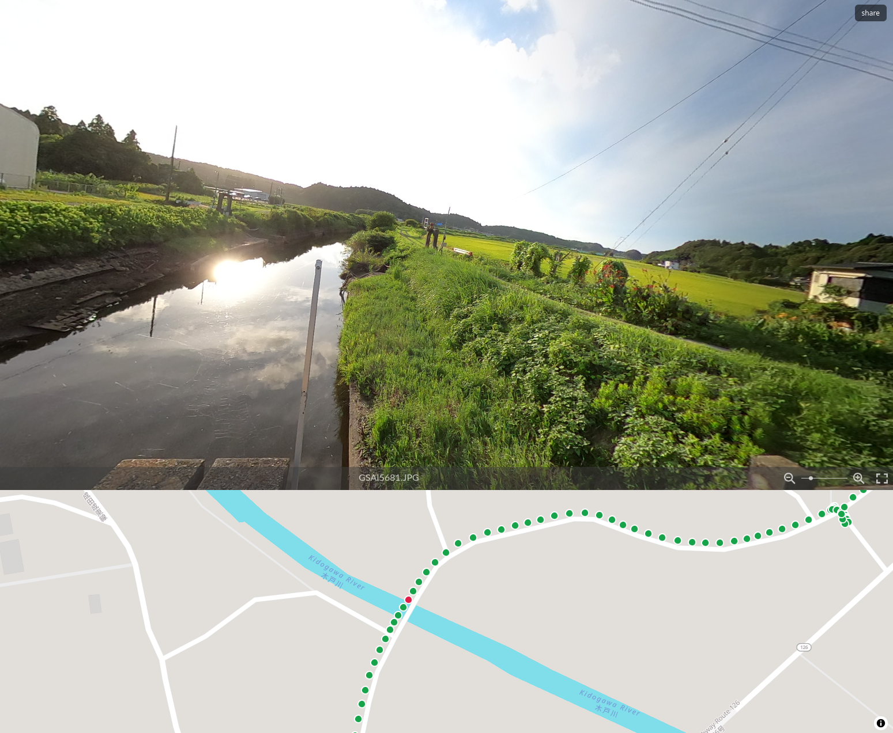

# photosphere-map-viewer

a simple static gps-tagged 360 photos viewer with [Photo Sphere Viewer](https://photo-sphere-viewer.js.org/) + [MapLibre](https://maplibre.org/) + [Protomaps](https://protomaps.com/).



## add photos

1. store 360 jpeg files in public/photos/
2. run `pnpm scan`

it scans GPS data into `public/photos.json`. non-GPS tagged photos are skipped.

## setup

copy `.env.sample` to `.env` and set your [protomaps](https://protomaps.com/api) API key:

```shell
cp .env.sample .env
```

## run dev server

```shell
pnpm install
pnpm dev
```

## build

```shell
pnpm install
pnpm build
pnpm preview
```

## URL params

supported params: `photo`, `zoom`, `yaw`, `pitch`

example: `/?photo=GSAH4185.JPG&zoom=50&yaw=180&pitch=15`

the "Share" button copies the current view as a URL.
